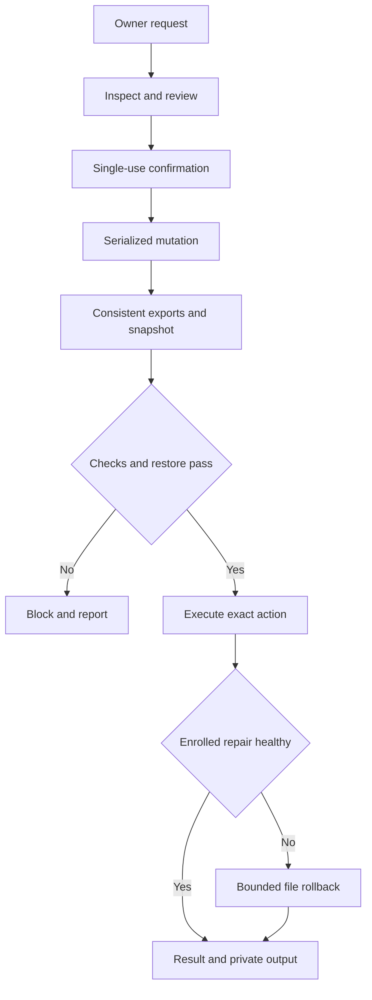

# Architecture

## Components

| Component | Account/state | Responsibility |
|---|---|---|
| Discord interface | `maestro`, `/var/lib/maestro` | Guild/numeric actor authorization, private views, report delivery |
| Telegram interface | `maestro-telegram`, `/var/lib/maestro-telegram` | Private actor sessions, polling, input workflow, separate delivery |
| Local broker | root, `/var/lib/maestro-agent` | Shared settings/jobs/incidents, probes, checkpoint gate and repair |
| Runner | `maestro-runner` | Optional non-root execution without sudo privileges |
| External witness | Optional separate machine/account | Reachability observations and outbound alerts only |

Default IPC is a permission-restricted Unix socket with SO_PEERCRED, frontend token and numeric actor checks. Pinned client-certificate mutual TLS is an optional **loopback-only** alternative. There is no public terminal HTTP API.

## Execution order

Ordinary terminal actions produce a result without pretending their arbitrary side effects have recipe rollback. Both interfaces share jobs/uploads only for explicitly linked identities. Confirmations remain scoped to the initiating actor. The broker permits two queued/active job tasks but one executing mutation. A process-level repository lock also prevents direct VPS checkpoint helpers competing with the agent.

## Monitoring

A persisted scheduler triggers 60-second watch, hourly reports and daily checks. Per-target health adapters and root resource metrics gather passive evidence. Incidents and diagnosis signatures deduplicate messages. Known failures run fixed read-only diagnostics; automatic changes require opt-in, repeat evidence, no competing controller/lease, budget and successful checkpoint.

Inventory is bounded by entry/depth/time/output limits. Saved PM2 and cron declarations are not live application checks. Database probes use read-only SQLite connections. No member business operations, role assignment, ledger refresh or raffle draws are replayed as a health test.

## Persistence and failure

SQLite WAL stores settings, revisions, incidents, audits, snapshots, review hashes, jobs, delivery acknowledgments, checkpoint and operation records. Each recipient has its own durable report acknowledgment. Outbox delivery is at-least-once and capped at 2,000 recent events.

Startup invalidates pending confirmations and marks unfinished jobs/operations/checkpoints interrupted. It reports interrupted checkpoint writer pauses rather than assuming they resumed. It never automatically replays owner code. Process groups are killed on cancellation/timeout/output cap; partial output remains private and downloadable when finalized.

systemd supervises all three services with restart and notify watchdogs. A single-agent file lock and Telegram poller lock prevent local duplicates. The optional external witness is necessary for observations while the VPS is offline; it cannot repair an offline machine.

## Additional Maestro boundaries

The broker has one process-level agent lock acquired before opening its state. Mutation jobs share one queue across both interfaces; revisions/digests protect concurrent configuration edits. Discovery runs independently every five minutes and adds disabled stable cards without erasing administrator settings. The broker enforces expiring delegate scopes while each frontend keeps isolated actor/session context.

Application adapters expose declared schemas and version pins. Verifier provisioning additionally uses its own Discord credential and the existing shared server-setup lease. A remote Discord mutation and SQLite commit cannot be made globally atomic; partial outcomes are retained for review and are never blindly replayed.

Categorized packages restore selected files/consistent exports from the just-verified encrypted snapshot, verify hashes, build private ZIPs and deliver checksummed bounded parts. They do not rescan a live database as a replacement for its checkpoint export.
